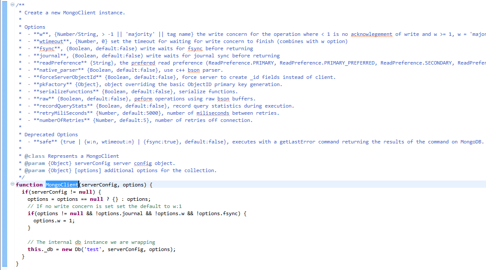

# JSDT require's JSDoc - Node.js with MongoDB native example

by Paul Verest

Eclipse JSDT does not yet support CommonJS.

But when playing with latest `mongodb` module (check <https://github.com/mongodb/node-mongodb-native>),

I was astonished by popup window with Docs


and underline when holding <kbd>Ctrl<kbd>


and click through


That was not some new feature in JSDT from Kepler 4.3.1, but relatively old JSDoc support.
So JSDT looks for all files in project ands processes sources, functions names & JSDoc annotations. Then I think, it matches by name.

In this line `var MongoClient = require('mongodb').MongoClient, format = require('util').format;'

'MongoClient' works, not because sources have JSDoc with annotation.  It worked without it.

```javascript
	/**
	 * @class Represents a MongoClient
	 * @param {Object} serverConfig server config object.
	 * @param {Object} [options] additional options for the collection.
	 */  
```



Check also <http://www.nodeclipse.org/2013/06/12/javascript-annotations.html>

And MongoDBNodeProject project <https://github.com/Nodeclipse/org.nodeclipse.examples/tree/master/MongoDBNodeProject>
