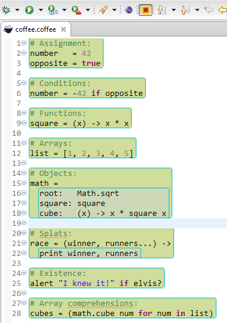

# Nodeclipse CoffeeScript Editor

Nodeclipse CoffeeScript Editor is continuation of work by Adam Schmideg with FORMULA 400.
Now it is just 2 persons Robert Gründle and Paul Verest, but we lack enough time to move it forward.
Current 0.3.0 is refresh release with no new features added, but icon and internally switch to quicker Maven/Tycho build.

CoffeeScript Editor is general editor for Node.js or web-projects.

### Hints

Just run your `.coffee` file to check if it can compile, 
and see coffee compiler message in `Console` View if it fails.
(right-click in any Editor with `.coffee` file inside, select Run As -> coffee).
This is quicker alternative to `coffee -c .` from command line.

### Note on XText Nature

Notice that before you start using CoffeeScript Editor, you `.project` file looks like

	<?xml version="1.0" encoding="UTF-8"?>
	<projectDescription>
		<name>NodeProject1</name>
		<comment></comment>
		<projects>
		</projects>
		<buildSpec>
			<buildCommand>
				<name>com.eclipsesource.jshint.ui.builder</name>
				<arguments>
				</arguments>
			</buildCommand>
		</buildSpec>
		<natures>
			<nature>org.nodeclipse.ui.NodeNature</nature>
			<nature>org.eclipse.wst.jsdt.core.jsNature</nature>
		</natures>
	</projectDescription>
	
If you just add `*.coffee` file and open it, Eclipse will ask  
.  
After that your `.project` file will be like:
	
	
	<?xml version="1.0" encoding="UTF-8"?>
	<projectDescription>
		<name>NodeProject1</name>
		<comment></comment>
		<projects>
		</projects>
		<buildSpec>
			<buildCommand>
				<name>org.eclipse.xtext.ui.shared.xtextBuilder</name>
				<arguments>
				</arguments>
			</buildCommand>
			<buildCommand>
				<name>com.eclipsesource.jshint.ui.builder</name>
				<arguments>
				</arguments>
			</buildCommand>
		</buildSpec>
		<natures>
			<nature>org.nodeclipse.ui.NodeNature</nature>
			<nature>org.eclipse.wst.jsdt.core.jsNature</nature>
			<nature>org.eclipse.xtext.ui.shared.xtextNature</nature>
		</natures>
	</projectDescription>
	
### Sources and contribution

Sources at <https://github.com/Nodeclipse/coffeescript-eclipse>.
We need help by those who mastered [Eclipse XText](http://www.eclipse.org/Xtext/).

 
