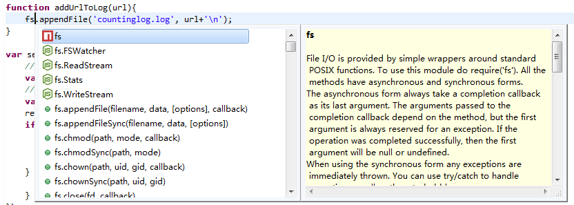
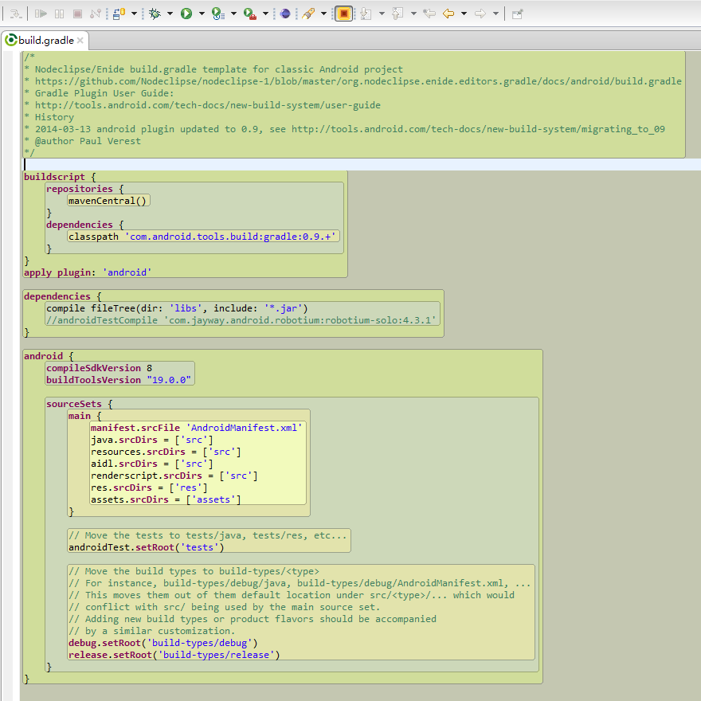

# Nodeclipse & Enide Features

More detailed and more recent features are at [history page](history).

## Node.js and JavaScript Features

<ul>
	<li>Creating default structure for New Node Project and New Node Source File</li>
	<li>Generating Express project with Wizard</li>
	<li>JavaScript Syntax highlighting</li>
	<li>Bracket matching and marking selection occurences with background color</li>
	<li>Content Assistant within one file (JSDT)</li>
	<li>Code completion for base Node.js modules</li>
	<li>experimental content assist from Orion IndexFiles for amqp, express, mongodb, mysql, postgres and redis node packages</li>
	<li>Go to definition with <kbd>Ctrl</kbd>+click when <a href="http://usejsdoc.org/">JSDoc is used</a></li>
	<li>Refactoring within one file (<kbd>Alt+Shift+R</kbd>)</li>
	<li>JSON files highlight and validation</li>
	<li>NPM support</li>
	<li>Debugging - Breakpoint, Trace, Variables, Expressions, etc... via modified Eclipse debugger plugin for V8 (Chromium Tools)</li>
	<li>Setting project properties for <a href="http://github.eclipsesource.com/jshint-eclipse/">JSHint-Eclipse</a> automatically;
		<a href="http://www.jshint.com/">JSHint</a> 
		settings <a href="https://github.com/Nodeclipse/nodeclipse-1/blob/master/org.nodeclipse.ui/templates/common-templates/.jshintrc">template</a> </li>
	<li>Specifying passed arguments to <code>node</code> and Node application (per every file and per whole workspace)</li>
	<li>Specifying environment variables values to use (per every file)</li>
	<li>Running CoffeeScript *.coffee files</li>
	<li>Running *.js files with PhantomJS, MongoDB Shell or Java 8 Nashorn <code>jjs</code> util.</li>
	<li>Supporting <code>*.njs, *.pjs, *.mjs</code> and <code>*.jjs</code> file extentions.</li>
	<li>Bundled together with
		<a href="http://marketplace.eclipse.org/content/markdown-text-editor/click">Markdown Editor</a>, 
		<a href="http://marketplace.eclipse.org/content/github-flavored-markdown-viewer-plugin/click">GitHub Flavored Markdown</a>, 
		<a href="http://marketplace.eclipse.org/node/641101/click">StartExplorer (for system explorer and shell)</a>,
		<a href="http://marketplace.eclipse.org/content/eclipse-regexp/click">RegExp</a>,
		<a href="http://marketplace.eclipse.org/content/eclipse-icons-editor/click">Icon Editor</a>,
		<a href="http://marketplace.eclipse.org/content/monjadb/click">MongoDB GUI</a>, 
		<a href="\restclient-tool">RestClient Tool</a>
		and other plugins (20+ in total, check update site(p2 repository) and 
		<a href="http://www.nodeclipse.org/updates/list">Nodeclipse Plugin List</a>)
		
		</li>
	<li>Support for Eclipse Juno, Kepler, Luna M3 (3.7, 3.8, 4.2, 4.3, 4.4)</li>
</ul>

 

## Java Features (as Enide)

- Lightweight Maven plugin (run Jetty, Tomcat; build any project with `pom.xml` from Eclipse/Enide Studio)  
<!--  --> 
<a href="img/enide-studio/EditBox-plugin-maven-example.PNG">
 
- Lightweight Gradle and Minimalist Gradle Editor plugins (run Jetty, JettyEclipse, Android; build any project with `build.gradle` from Eclipse/Enide Studio)  
<!--  -->
<a href="img/enide-studio/EditBox-plugin-gradle-example.PNG">
 

Continue reading on [usage page](usage).
